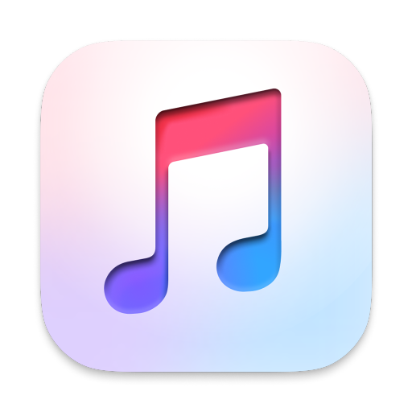

<h1 align="center"> </h1>

<h3 align="center">🍎 Apple Music Discord RPC!</h3>

    Rust + JavaScript for Automation (JXA) Discord Rich Presence Client for the macOS Apple Music app (Catalina and later) and legacy iTunes.
     
    <strong>Version: </strong>1.0.0
     
     
    
    
     
     
    <a href="https://github.com/EETagent/Apple-Music-Discord-RPC/issues">Report issues</a>
  

## 🔔 Information

## 👏 Credits

- https://github.com/NextFire/apple-music-discord-rpc
